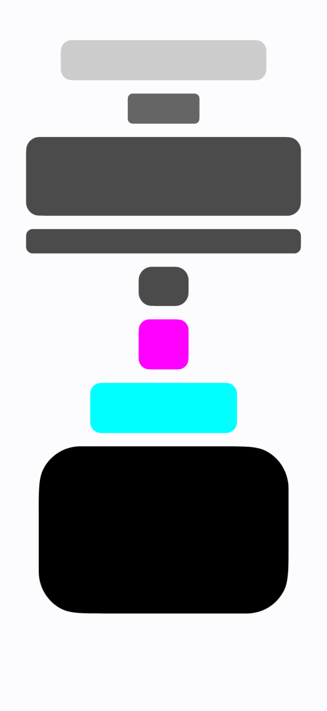
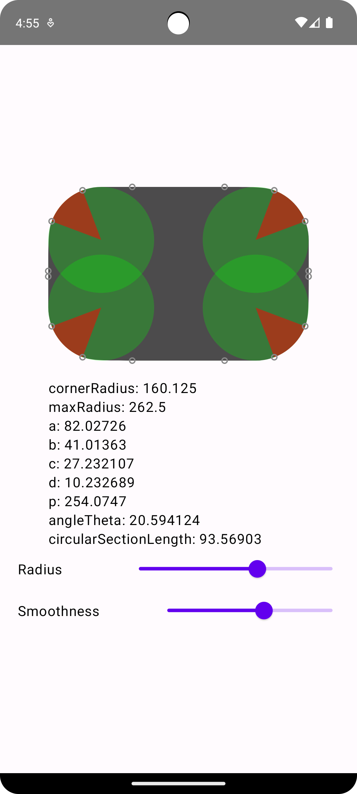

# Smoother
Simple Jetpack Compose implementation of round rects with smoother corners that match Figma corner smoothing.

Demo

Debug UI

All the maths ported over from JavaScript from this handy approximation: https://github.com/MartinRGB/Figma_Squircles_Approximation
